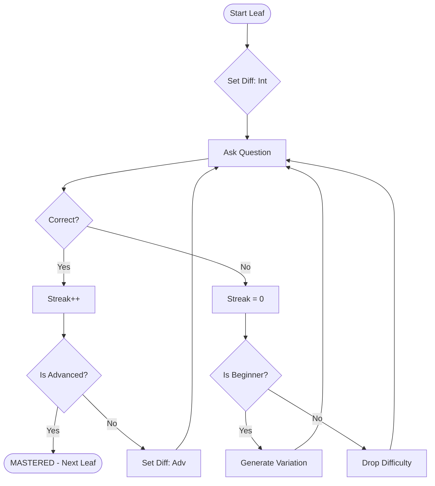

# Tutor Agent Algorithm: The "Adaptive Depth-Probe"

## 1. High-Level Traversal (Graph Navigation)
We treat the Knowledge Graph as a "Map". The goal is to traverse from the Root to all Leaves, marking them as `MASTERED`.

**Strategy: "Cluster-based BFS"**
1.  **Queue Initialization**: Add the Root's immediate children (Sub-topics) to a `PracticeQueue`.
2.  **Breadth First**: The user picks a high-level Sub-topic (e.g., "Variables").
3.  **Depth Focus**: Once inside a Sub-topic, we find all reachable **Leaf Nodes** (Concepts).
4.  **Concept Loop**: We iterate through these Leaves sequentially. We do not exit the Sub-topic until all its Leaves are `MASTERED` (or the user explicitly quits).

---

## 2. The Mastery Loop (Node-Level Logic)
For a specific Leaf Node (e.g., "Variable Assignment"), we run the **Adaptive Assessment Loop**.

### A. The "Probe" (Initial Assessment)
Instead of boring the user with easy questions, we probe their skill.
1.  **Start at INTERMEDIATE Difficulty.**
2.  Serve the first *Intermediate* question.

### B. Result Handling
Based on the answer, we branched:

#### 🟢 Scenario 1: Success (Fast-Track)
*   **Action**: User got it RIGHT.
*   **Logic**:
    *   Streak += 1.
    *   If `Difficulty == Intermediate` AND `Streak >= 1`:
        *   **Promote** to `Advanced`.
    *   If `Difficulty == Advanced` AND `Streak >= 1`:
        *   **Mark Node as MASTERED.** (User proved competence).
        *   *Exit Node, move to next Leaf.*

#### 🔴 Scenario 2: Failure (Remediation)
*   **Action**: User got it WRONG.
*   **Logic**:
    *   Streak = 0.
    *   **Diagnose**: Why did they fail? (Capture implicit error).
    *   **Demote**:
        *   If `Difficulty == Advanced` -> Drop to `Intermediate`.
        *   If `Difficulty == Intermediate` -> Drop to `Beginner`.
        *   If `Difficulty == Beginner` -> **Stay** (Remediation Mode).
    *   **Serve Remediation**:
        *   Fetch a *different* question from the new bucket.

### C. The "infinite" Remediation (Dynamic Generation)
*   **Trigger**: User is stuck in `Beginner` or `Intermediate` and we have run out of pre-generated questions in that bucket.
*   **Action (LLM Call)**:
    *   Prompt: "User failed question X about concept Y. Generate a *new variation* of this question that tests the same principle but with different values/context."
    *   Serve this new question immediately.
    *   This satisfies: *"If fail he should be given more questions of similar type"*.

---

## 3. Session State Management
We need to track this live.

```python
class SessionState:
    queue: list[NodeID]       # Nodes waiting to be studied
    current_node: NodeID      # Active Concept
    
    # Per-Node Progression
    node_stats: {
        "node_id": {
            "current_difficulty": "intermediate", # adaptive pointer
            "consecutive_correct": 0,
            "attempts": [],
            "status": "in_progress" | "mastered"
        }
    }
```

## 4. Flowchart Summary

